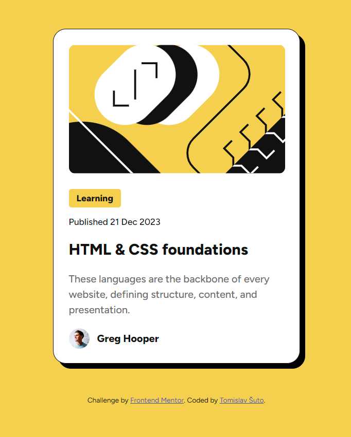

# Frontend Mentor - Blog preview card solution

This is a solution to the [Blog preview card challenge on Frontend Mentor](https://www.frontendmentor.io/challenges/blog-preview-card-ckPaj01IcS). Frontend Mentor challenges help you improve your coding skills by building realistic projects. 

## Table of contents

- [Overview](#overview)
  - [Screenshot](#screenshot)
  - [Links](#links)
- [My process](#my-process)
  - [Built with](#built-with)
  - [What I learned](#what-i-learned)
  - [Continued development](#continued-development)
- [Author](#author)

## Overview

### Screenshot

### Links

- Solution URL: [Solution URL](https://github.com/RetroApe/blog-preview-card-main)
- Live Site URL: [Live URL Site](https://retroape.github.io/blog-preview-card-main/)

## My process

- Thought about the elements used in the design
- Entered every element in HTML
- Used `border` on every element to better see how they are positioned
- Adjusted the positioning first
- Adjusted the styling next
- At the end, took up a challenge to not use `@media`

### Built with

- CSS
- HTML

### What I learned

I better learned how to position the elements, but I think there are better ways.

Instead of using `@media`, I used `clamp` and viewport width to scale the elements down for smaller screens, as is designated in the design files.

### Continued development

The positioning of elements is mostly "hard-coded." I should have used `flex` to position overall elements instead of putting margin and padding to every little thing.

I am not satisfied with the usage of `clamp` and viewport width. It does the job, but I wanted that every element scales uniformly at the same time. I had to mostly guess the values. I would like know in the future what are other possibilites or if there is another way to use the two.

## Author

- Frontend Mentor - [@RetroApe](https://www.frontendmentor.io/profile/RetroApe)
- LinkedIn - [@tomislavsuto81](https://www.linkedin.com/in/tomislavsuto81/)
